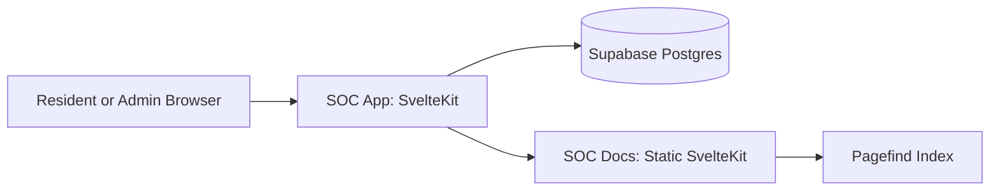

The SOC platform consists of a web client, static documentation site, and managed backend services.

## Why this matters

This architecture keeps the docs site fully static while preserving a clear bridge to in-app help.
