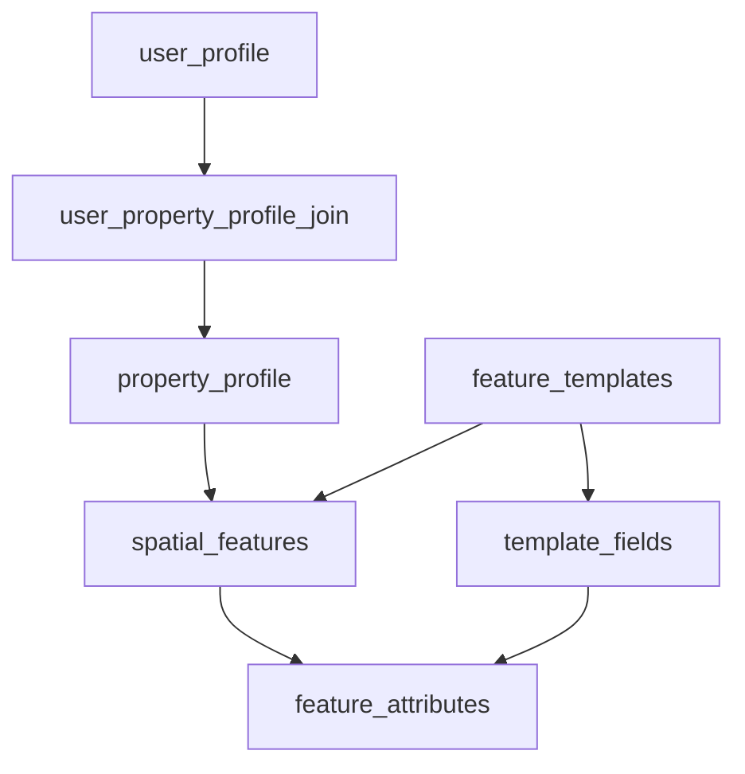

SOC uses PostgreSQL 15 with PostGIS and a single public schema guarded by row-level security.
The data model is multi-tenant and claim-aware, with access boundaries enforced by policy.

## Core model

- One user can participate in multiple communities through optional community profile tables.
- One user can be linked to many properties through a join table.
- One property can have many spatial features (assets, hazards, operational items).
- Spatial features are template-driven, with flexible attributes stored separately.

## Relationship map

## Important tables

### Identity and community

- user_profile: canonical user record linked to auth users.
- community_bcyca_profile, community_tinonee_profile, community_mondrook_profile, community_external_profile: community-specific profile extensions.

### Property and spatial domain

- property_profile: address-linked property records, including community and KYNG assignment.
- spatial_features: geometry records linked to properties and templates.
- feature_templates: allowed feature types, geometry kind, and category.
- template_fields: field definitions per template.
- feature_attributes: concrete values for template fields, keyed per feature.

### Authorization support

- user_roles: user to role assignments.
- role_permissions: role to permission mappings.
- user_permissions: optional direct user overrides.

## Spatial conventions

- Primary SRID is 7844 (GDA2020).
- Geometry exchanged with clients as GeoJSON where needed.
- Spatial validation and containment checks run in database routines before commit for sensitive edits.

## What to read next

- [Row-Level Security](/docs/technical/database/row-level-security)
- [Migrations Workflow](/docs/technical/database/migrations-workflow)
- [Generated Types](/docs/technical/database/generated-types)
