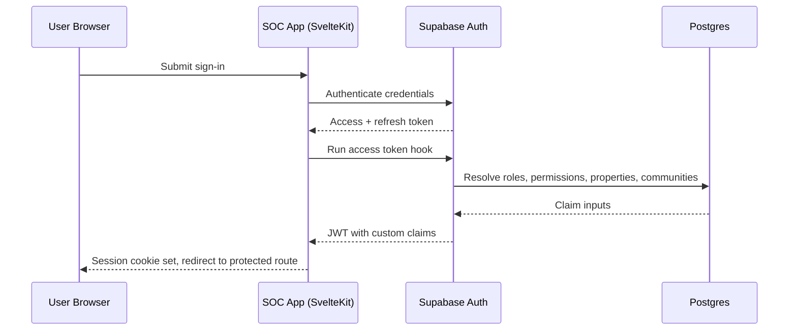

SOC uses Supabase SSR authentication with server-managed session handling.
The server validates session state on requests and exposes authenticated context to layouts.

## High-level flow

## Runtime responsibilities

- Server hook: initializes auth client, validates session, and resolves role context.
- Root server layout: loads session, role, permission, and user-profile data for the app shell.
- Client layout: syncs session state for browser navigation.

## Invalid and expired session behavior

- Missing or invalid session on protected routes redirects to sign-in.
- Session refresh failures route users through a sign-in recovery path.
- Sign-out clears server session state and related tracking cookies.

## Claim generation

JWT custom claims are built from role and profile tables so downstream checks avoid repeated permission lookups.
Key claim categories include role tier, granted permissions, property scope, and community scope.

## Related pages

- [Authorization and Permissions](/docs/technical/auth-and-sessions/authorization-and-permissions)
- [Session Lifetime](/docs/technical/auth-and-sessions/session-lifetime)
