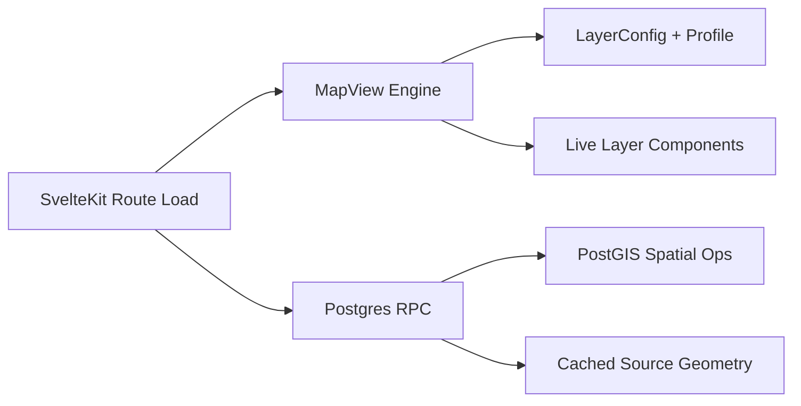

SOC uses a single declarative map engine built around MapView profiles and LayerConfig definitions.
The stack supports both read-only operational maps and interactive capture/edit workflows.

## Frontend stack

- SvelteKit routes load map data on the server and pass resolved layer data into the map shell.
- A single MapView engine renders maps using Leaflet with profile-driven basemaps and controls.
- LayerConfig definitions drive layer geometry handling, styling, and interactions.
- Live viewport layers are mounted as child components for sources that refetch on pan/zoom.

## Editing stack

- Leaflet.Editable is the primary edit interaction library.
- Leaflet.GeometryUtil provides snapping math for draw and vertex operations.
- Capture workflows are implemented through dedicated controller/components in the map engine.

## Server and data access

- Route loads and endpoints call database RPC functions for map-ready data.
- PostGIS functions enforce geometry integrity and perform spatial operations.
- GeoJSON is served in EPSG:4326 to clients, with storage and reference data managed per SRID contract.

## Architecture model

## Extension points

- Add a new map by composing a profile plus one or more layer configs.
- Add a new static layer by defining config + style/interaction behavior.
- Add a viewport-driven layer using the live-layer child pattern.

## Operational guidance

- Keep one engine for all map routes to avoid architecture drift.
- Prefer profile/layer composition over route-specific map implementations.
- Use map profile attribution fields whenever NSW source data is shown.

## Related pages

- [Spatial Data Pipeline](/docs/technical/gis-and-mapping/spatial-data-pipeline)
- [KYNG Boundary Editor](/docs/technical/gis-and-mapping/kyng-boundary-editor)
- [Geoscape Tiles](/docs/technical/gis-and-mapping/geoscape-tiles)
