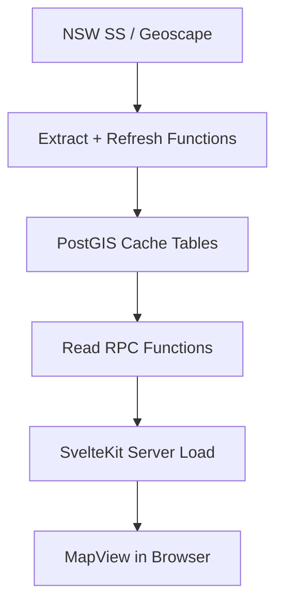

SOC ingests authoritative spatial datasets, caches reference geometry in PostGIS, and serves map-ready GeoJSON through RPCs and route endpoints.
The pipeline is designed for reliability, provenance, and predictable map performance.

## Sources

- NSW Spatial Services (ArcGIS REST): primary source for property/address/reference geometry.
- Geoscape G-NAF services: geocoding and contextual tile data via server proxy.

## Ingestion and cache model

- In-database extraction functions harvest and refresh NSW reference layers.
- Cached tables are stored in PostGIS with provenance metadata.
- Refresh jobs run on a scheduled cadence through pg_cron.

## Provenance fields

Cached spatial tables include source tracking fields such as:

- source
- source_layer
- fetched_at

These make staleness measurable and support operational auditing.

## SRID contract

- Reference geometry is stored in EPSG:7844 (GDA2020).
- Client-facing geometry is served as EPSG:4326 (WGS84).
- Transforms happen at the database boundary before payload delivery.

## Delivery flow

## Quality controls

- Extraction jobs write to refresh logs and include retry/backoff behavior.
- Spatial QA checks flag anomalies such as gaps, invalid geometry, or assignment edge cases.
- Validation RPCs enforce geometry correctness for user-authored capture features.

## Operational responsibilities

- Keep refresh schedule active and monitored.
- Verify attribution and data-currency display for NSW data in map profiles.
- Review border/coverage QA views after major refreshes or topology-affecting changes.

## Related pages

- Map architecture: /docs/technical/gis-and-mapping/mapping-stack
- KYNG boundary fabric and edit session workflow: /docs/technical/gis-and-mapping/kyng-boundary-editor
- Geoscape-specific proxy behavior: /docs/technical/gis-and-mapping/geoscape-tiles
